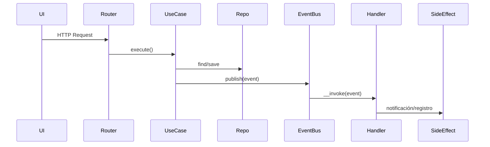

# Arquitectura del proyecto — Clean Marvel Album

Clean Marvel Album aplica **Arquitectura Limpia** en **PHP 8.2+**, desacoplando la UI, los casos de uso y la infraestructura, y orquestando microservicios de IA para generar cómics y comparar héroes.

## Capas principales

```
Presentation (public/, src/Controllers, views/)
└── Application (UseCases, servicios AI, seeds)
    └── Domain (Entities, VOs, Events, Repositories)
        └── Infrastructure (Repos JSON/DB, EventBus, adaptadores externos)
```

- **Presentación:** Front Controller `public/index.php`, router HTTP (`App\Shared\Http\Router`), controladores en `src/Controllers` y vistas en `views/`. Solo orquesta y devuelve HTML/JSON.
- **Aplicación:** Casos de uso en `src/*/Application`, servicios de IA en `src/AI`, dev tools en `src/Dev` (seeders, runner PHPUnit). No conoce HTTP ni persistencia concreta.
- **Dominio:** Entidades y Value Objects (`Hero`, `Album`, etc.), eventos (`HeroCreated`, `AlbumUpdated`), contratos de repositorio. Sin dependencias externas.
- **Infraestructura:** Implementa contratos con repositorios JSON/DB en `src/*/Infrastructure`, EventBus en memoria (`App\Shared\Infrastructure\Bus`), gateways externos y adaptadores a APIs.

Dependencias siempre fluyen hacia el dominio. `App\Config\ServiceUrlProvider` resuelve endpoints según entorno (`local`, `hosting`).

## Persistencia y ambientes
- **Local (`APP_ENV=local`)**: repositorios JSON en `storage/`.
- **Hosting (`APP_ENV=hosting`)**: repositorios PDO MySQL con fallback automático a JSON si falla la conexión.
- Logs y actividad se guardan en `storage/notifications.log` y `storage/activity/*.json`.

## EventBus y handlers
- Eventos de dominio se publican en memoria y sus handlers se registran en `src/Bootstrap/EventBootstrap.php` (invocado desde `src/Bootstrap/AppBootstrap.php`).
- Los handlers deben ser idempotentes y no depender de la capa de presentación.

## Microservicios y servicios externos
- **openai-service** (`openai-service/`, puerto 8081): `POST /v1/chat`, cURL a OpenAI, fallback JSON sin `OPENAI_API_KEY`.
- **rag-service** (`rag-service/`, puerto 8082): `POST /rag/heroes`, usa `storage/knowledge/heroes.json`, retriever léxico por defecto (vectorial opcional con embeddings) y delega a `openai-service`.
- **Heatmap service** (Python/Flask): registra eventos de clic para `/secret-heatmap`. Ver `docs/microservicioheatmap/README.md`.
- **WAVE API**: accesibilidad vía `public/api/accessibility-marvel.php`.
- **ElevenLabs TTS**: narración de cómics y comparaciones RAG en `/api/tts-elevenlabs.php`.

## Paneles y UI técnica
- **Cómic + RAG** (`/comic`): genera historia Marvel y comparación de héroes, con audio ElevenLabs opcional.
- **Panel GitHub** (`/panel-github`): actividad de PRs.
- **SonarCloud** (`/sonar`), **Sentry** (`/sentry`), **Accesibilidad** (`/accessibility`, WAVE), **Performance** (`/performance`, PSI), **Heatmap** (`/secret-heatmap`), **Repo browser** (`/repo-marvel`), **Vista de documentación** (`/readme`).
- Acciones rápidas en la cabecera permiten saltar entre paneles.

## Comunicación entre capas y servicios

1. Petición HTTP entra por `public/index.php` y, para rutas distintas de `/`, delega en `public/home.php` donde `App\Shared\Http\Router` resuelve el controlador.
2. El controlador delega en el caso de uso de la capa de Aplicación.
3. El caso de uso manipula entidades y dispara eventos de dominio.
4. Los handlers pueden notificar, registrar actividad o invocar adaptadores externos (GitHub API, WAVE, ElevenLabs, microservicios IA).
5. Las respuestas se devuelven como HTML o JSON, manteniendo el dominio independiente de infraestructura.

## Seguridad (v1.2.0)
- **CSP con Nonces**: Content Security Policy estricta con nonces dinámicos (128 bits)
- **Protección XSS**: Scripts inline bloqueados, solo permitidos con nonce válido
- **CSRF Protection**: Tokens únicos por sesión
- **Rate Limiting**: 100 requests/minuto
- **Session Security**: Validación de IP y User-Agent
- Tests automatizados para cabeceras/CSP/CSRF/rate-limit/sesión (ver `tests/Security/`)

Ver [docs/security/](../security/) para más detalles.

## Despliegue en Kubernetes (visión general)

El repositorio incluye manifiestos en `k8s/` que describen un despliegue en Kubernetes (Deployments, Services e Ingress). El despliegue en Kubernetes es opcional y complementa los escenarios local/hosting; la guía operativa se detalla en `k8s/DEPLOY_K8S.md`.
